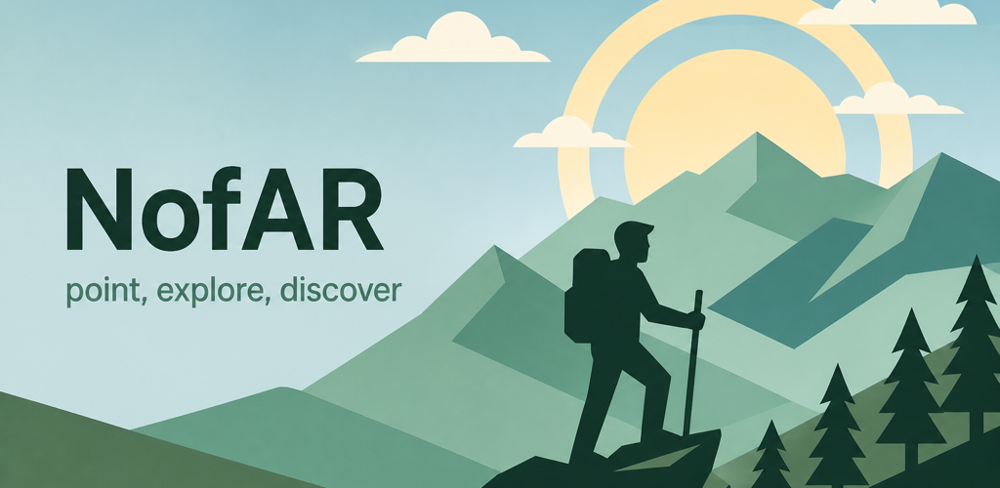
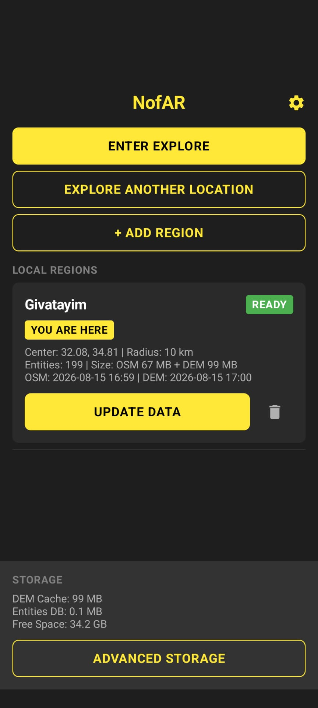
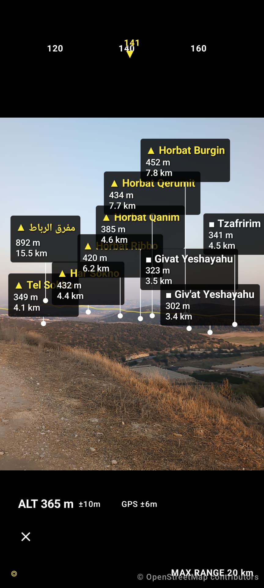
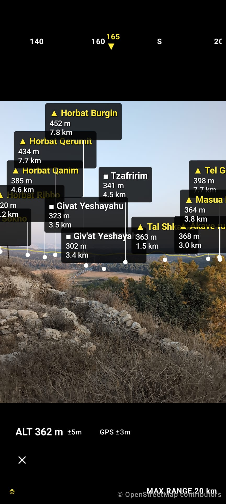

# NofAR

**Point, explore, discover.**

<p align="center">
  
</p>

NofAR is an offline-first Android app for hikers and travelers. Download map data for your area or a curated country pack, then point your phone at the horizon to see terrain-aware labels for visible peaks, cities, towns, and villages — filtered by real line-of-sight over the landscape.

No accounts. No backend. No tracking.

<p align="center">
  
  
  
</p>

| | |
|---|---|
| **Platform** | Android 8.0+ (API 26) |
| **Package** | `com.nofar.app` |
| **License** | [Apache 2.0](LICENSE) |
| **Status** | v1.0.0 Initial Release |
| **Privacy** | [Policy](https://yuvallb.github.io/NofAR/privacy/) · [source](docs/privacy.md) |

---

## Features

- **Offline Explore** — Once map data is downloaded, Explore and Home work without network access.
- **Terrain-aware visibility** — Labels are hidden when mountains or ridges block the view, using live DEM raycasting (not precomputed horizon grids).
- **Cell-based coverage** — Simple mode downloads a 3×3 ring of 1° map cells around you, or an optional country pack (Israel, Switzerland, Greece when storage allows).
- **Three modes**
  - **Home** — Manage downloaded map sets, see status, enter Explore when coverage is ready.
  - **Prepare** — Tap 1° cells on a map and download OSM + GLO-90 elevation (internet required; resumable).
  - **Explore** — Full-screen camera view with compass-corrected AR labels for what you can actually see.
- **Privacy by design** — GPS-only location (no network location), no analytics, no crash reporting that phones home.

**Permissions:** precise location and camera (Explore / coverage detection); internet only for Prepare downloads. A real device outdoors works best for GPS and compass.

---

## How it works

```
Prepare   Select 1° cells → Overpass (city/town/village/peak) + Copernicus GLO-90
          → convert to int16 .bin rasters → store locally → READY

Explore   GPS + smoothed compass → spatial query (100 km) → live terrain raycast
          → project visible labels onto camera overlay (≥ 30 FPS)

Home      Coverage list + cell membership → Prepare or Explore
```

During Explore, visibility and rendering run on two cadences: a low-frequency pass (raycasting, ≤ every 2 s or 20 m movement) and a high-frequency AR overlay (sensor-smoothed reprojection only — no DEM work on the render thread).

---

## Data sources

| Source | Use | License / attribution |
|--------|-----|------------------------|
| [OpenStreetMap](https://www.openstreetmap.org/) via [Overpass API](https://wiki.openstreetmap.org/wiki/Overpass_API) | Places (`city`, `town`, `village`) and peaks (`natural=peak`) | [ODbL](https://www.openstreetmap.org/copyright) — *© OpenStreetMap contributors* |
| [Copernicus DEM GLO-90](https://spacedata.copernicus.eu/) | 90 m elevation for terrain occlusion | *Copernicus DEM, ESA / Airbus* |

Overpass requests use a descriptive `User-Agent` and tiered public mirror failover. DEM tiles are cached globally by 1° cell and shared across overlapping coverage sets.

---

## Getting started

### Android app

Requirements: **JDK 26** (Gradle runtime; Android modules compile to JVM 17 bytecode), Android SDK, a device or emulator on API 26+.

**Android SDK (one-time):** Install [Android Studio](https://developer.android.com/studio) (or the command-line SDK tools). The default SDK path on macOS is `~/Library/Android/sdk`. Point Gradle at it:

```bash
cp local.properties.example local.properties
# Edit sdk.dir= if your SDK lives elsewhere (Android Studio → Settings → Android SDK → Android SDK Location)
```

```bash
./gradlew :app:assembleDebug
./gradlew spotlessCheck detekt lint test
```

**Release builds** (minified). For a Play-signed AAB, copy [`keystore.properties.example`](keystore.properties.example) → `keystore.properties` and point it at your upload keystore (never commit secrets). Without that file, release falls back to the debug keystore so CI still works — do not upload that to Play.

```bash
./gradlew :app:assembleRelease :app:bundleRelease
# Optional device smoke-test:
# adb install -r app/build/outputs/apk/release/app-release.apk
```

CI runs `spotlessCheck`, `detekt`, `lint`, `test`, `assembleDebug`, and `assembleRelease` on pull requests.

Store listing copy and graphics live under [`fastlane/metadata/android/en-US/`](fastlane/metadata/android/en-US/) (add real phone screenshots before submitting to Play / F-Droid).

---

## Architecture

The app follows the modular layout of [Now in Android](https://github.com/android/nowinandroid):

```
:app
:core:model, :core:common, :core:database, :core:data, :core:network
:core:location, :core:sensors, :core:visibility
:core:ui, :core:designsystem, :core:testing
:feature:home, :feature:prepare, :feature:explore, :feature:settings
:build-logic:convention
```

- **UI:** Jetpack Compose (Material 3), CameraX for the Explore camera feed
- **Persistence:** SQLite with R-Tree spatial index; DEM stored as memory-mapped GLO-90 int16 `.bin` rasters (GeoTIFF decode is Prepare-only)
- **Sensors:** Rotation vector + `GeomagneticField` declination + One Euro Filter smoothing
- **DI / async:** Hilt, Kotlin Coroutines, `Flow`
- **No ARCore dependency** — keeps builds reproducible and F-Droid-friendly

Feature modules depend only on `core:*`, not on each other. Unidirectional flow: **Compose → ViewModel → Repository → DataSource**.

---

## What NofAR is not (MVP)

- No user accounts or cloud sync
- No offline routing or turn-by-turn navigation
- No 3D terrain mesh — elevation is used for occlusion only
- No hosted country-pack downloads (packs are built on-device from Copernicus + Overpass)
- No road data
- No AI / LLM features
- No analytics or telemetry

---

## Contributing

Contributions are welcome. See [CONTRIBUTING.md](CONTRIBUTING.md) for branch naming, PR checklist, and code style. Keep changes aligned with the existing architecture and privacy constraints (no proprietary analytics, no network in Explore/Home).

- Issues: [github.com/yuvallb/NofAR/issues](https://github.com/yuvallb/NofAR/issues)
- Privacy: [yuvallb.github.io/NofAR/privacy](https://yuvallb.github.io/NofAR/privacy/)

For agent-assisted development in this repo, see [AGENTS.md](AGENTS.md).

---

## License

Copyright 2026 NofAR contributors

Licensed under the Apache License, Version 2.0. See [LICENSE](LICENSE).

OpenStreetMap data used by the app is © OpenStreetMap contributors, available under the Open Database License. Copernicus DEM requires the attribution above when displaying derived products.
